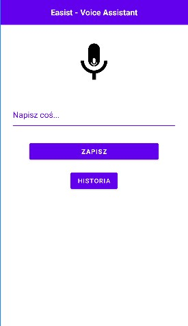
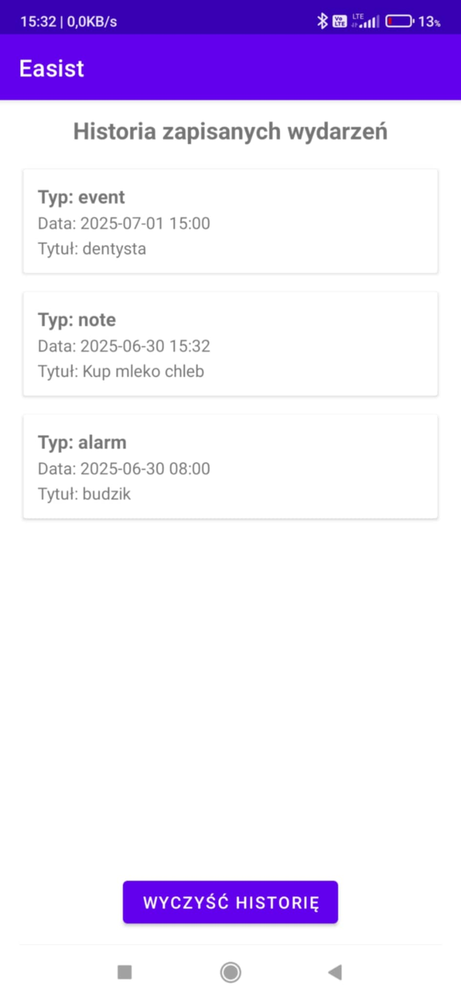

# 📅 Easist – Twój prywatny asystent głosowy 📱

## 📸 Screenshots
Widok główny:  

Historia wydarzeń:

## ✨ Co potrafi Easist?

✅ Rozpoznawanie mowy (Speech-to-Text)  
✅ Wysyłanie tekstu do endpointu (`/parse-event`)  
✅ Automatyczne zapisywanie wydarzeń do **lokalnego kalendarza Android**  
✅ Ustawianie **alarmów głosem**  
✅ Zapisywanie **notatek głosem**  
✅ **Historia zapisanych wydarzeń z możliwością usuwania pojedynczych lub wszystkich**

---

## 🚀 Jak działa?

🎤 **Klikasz mikrofon ➔ mówisz np. „Dentysta jutro o 15”**  
🧠 Easist rozpoznaje mowę i wysyła ją do backendu (FastAPI + OpenAI)  
📅 Automatycznie tworzy wydarzenie w **lokalnym kalendarzu Android**  
⏰ Ustawia budzik/alarm jeśli wykryje intencję  
📝 Zapisuje notatki głosem  
📜 Dodaje wydarzenia do **historii zapisanych wydarzeń** w aplikacji

---

## 🛠️ Technologie

- **Java (Android Studio)**
- `SpeechRecognizer` (online STT)
- Lokalny kalendarz Android
- `AlarmManager` do budzików
- Zapisywanie notatek
- **RecyclerView** do historii
- **FastAPI + OpenAI** do parsowania tekstu

---

## 🗂️ Historia zapisanych wydarzeń

- Zapisuje **typ, tytuł, datę, godzinę** każdego wydarzenia
- Wyświetla w czytelnej liście w aplikacji
- Długie kliknięcie ➔ usuwa pojedynczy wpis
- Przycisk w menu ➔ usuwa całą historię jednym kliknięciem

---

## 🛡️ Bezpieczeństwo kluczy API

Klucze API NIE są trzymane publicznie w repo.  
Przed uruchomieniem aplikacji uzupełnij w `MainActivity.java`:

```java
private final String API_URL = "https://twoj-url";
private final String API_KEY = "sk_live_twoj_klucz";
```
💡 Trzymaj w local.properties lub secrets.txt lokalnie.

📦 Instalacja
1️⃣ Sklonuj repo:

```bash
git clone https://github.com/TwojUser/Easist_android.git
```
2️⃣ Otwórz w Android Studio
3️⃣ Podłącz telefon lub użyj emulatora
4️⃣ Uruchom aplikację 🚀

⚙️ Backend (FastAPI)
Do działania wymagany jest endpoint /parse-event, który:

✅ Przyjmuje tekst użytkownika
✅ Rozpoznaje intencję (event/alarm/note)
✅ Zwraca JSON z:

```json
{
  "title": "Dentysta",
  "date": "2024-06-28",
  "time": "15:00",
  "type": "event"
}
```
Backend bazuje na FastAPI + OpenAI i działa lokalnie lub na VPS.

🚧 Plany rozwoju
✅ Edycja wydarzeń z historii
✅ Sortowanie

📜 Licencja
Projekt Easist rozwijany prywatnie.
Masz pytania? Napisz na Discord / Twitter / Email.
